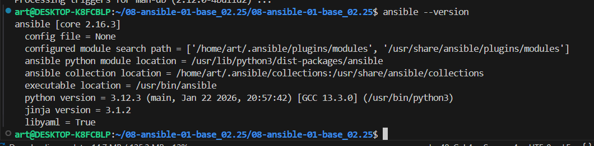
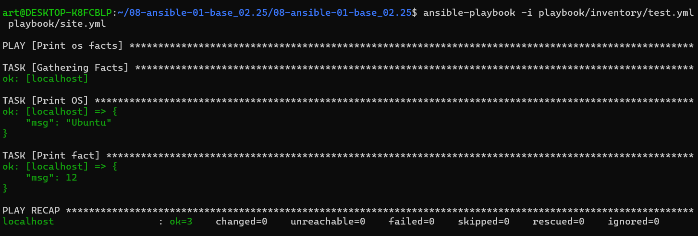
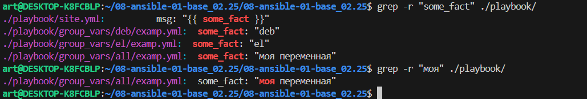
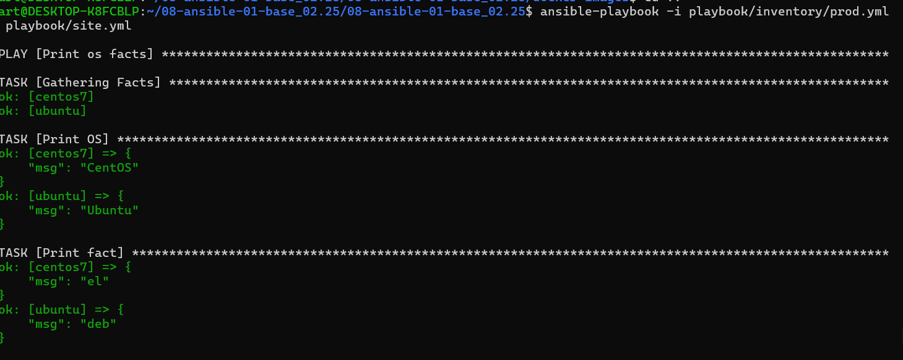
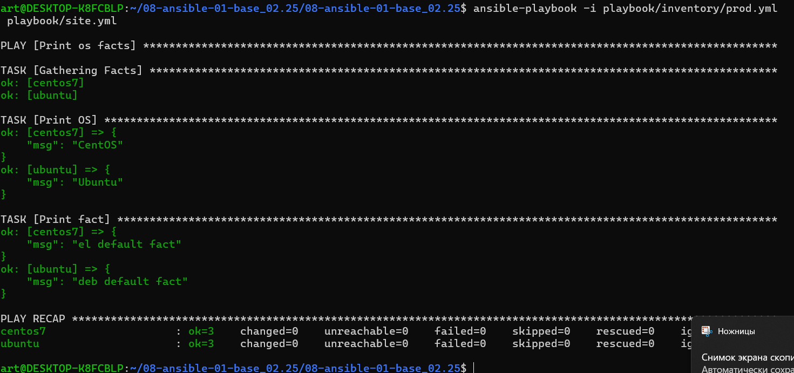
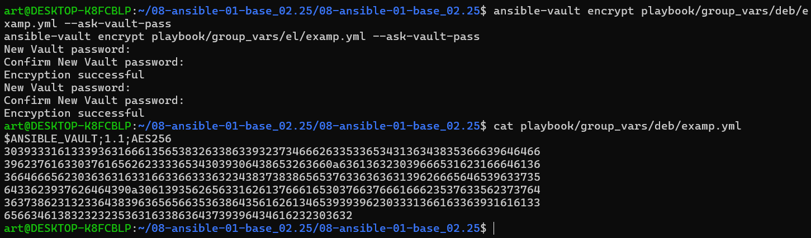
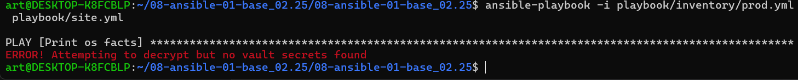
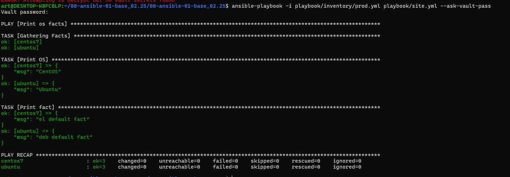
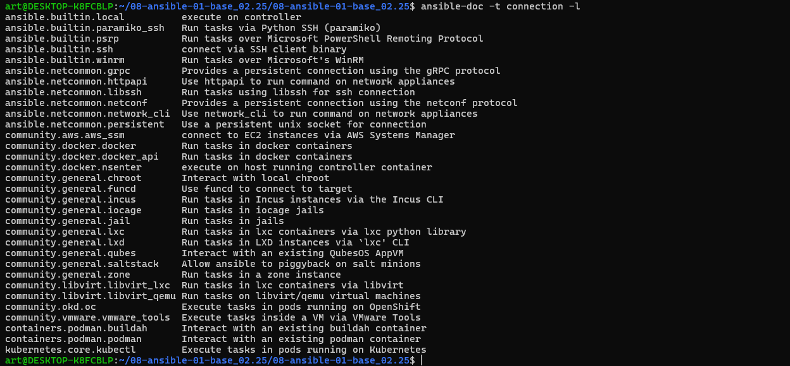
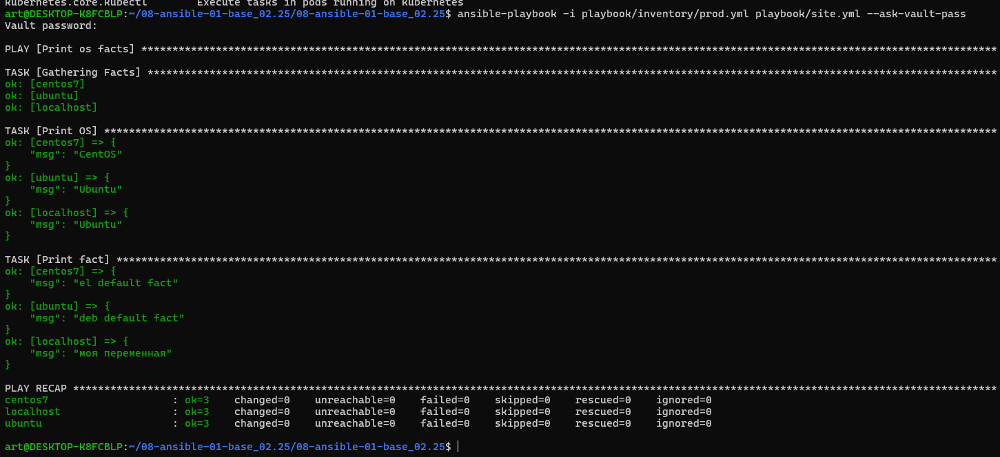

# Домашнее задание к занятию 1 «Введение в Ansible»

## Подготовка к выполнению

1. Установите Ansible версии 2.10 или выше.
2. Создайте свой публичный репозиторий на GitHub с произвольным именем.
3. Скачайте [Playbook](./playbook/) из репозитория с домашним заданием и перенесите его в свой репозиторий.

## Основная часть

1. Попробуйте запустить playbook на окружении из `test.yml`, зафиксируйте значение, которое имеет факт `some_fact` для указанного хоста при выполнении playbook.
2. Найдите файл с переменными (group_vars), в котором задаётся найденное в первом пункте значение, и поменяйте его на `all default fact`.
3. Воспользуйтесь подготовленным (используется `docker`) или создайте собственное окружение для проведения дальнейших испытаний.
4. Проведите запуск playbook на окружении из `prod.yml`. Зафиксируйте полученные значения `some_fact` для каждого из `managed host`.
5. Добавьте факты в `group_vars` каждой из групп хостов так, чтобы для `some_fact` получились значения: для `deb` — `deb default fact`, для `el` — `el default fact`.
6.  Повторите запуск playbook на окружении `prod.yml`. Убедитесь, что выдаются корректные значения для всех хостов.
7. При помощи `ansible-vault` зашифруйте факты в `group_vars/deb` и `group_vars/el` с паролем `netology`.
8. Запустите playbook на окружении `prod.yml`. При запуске `ansible` должен запросить у вас пароль. Убедитесь в работоспособности.
9. Посмотрите при помощи `ansible-doc` список плагинов для подключения. Выберите подходящий для работы на `control node`.
10. В `prod.yml` добавьте новую группу хостов с именем  `local`, в ней разместите localhost с необходимым типом подключения.
11. Запустите playbook на окружении `prod.yml`. При запуске `ansible` должен запросить у вас пароль. Убедитесь, что факты `some_fact` для каждого из хостов определены из верных `group_vars`.
12. Заполните `README.md` ответами на вопросы. Сделайте `git push` в ветку `master`. В ответе отправьте ссылку на ваш открытый репозиторий с изменённым `playbook` и заполненным `README.md`.
13. Предоставьте скриншоты результатов запуска команд.

## Необязательная часть

1. При помощи `ansible-vault` расшифруйте все зашифрованные файлы с переменными.
2. Зашифруйте отдельное значение `PaSSw0rd` для переменной `some_fact` паролем `netology`. Добавьте полученное значение в `group_vars/all/exmp.yml`.
3. Запустите `playbook`, убедитесь, что для нужных хостов применился новый `fact`.
4. Добавьте новую группу хостов `fedora`, самостоятельно придумайте для неё переменную. В качестве образа можно использовать [этот вариант](https://hub.docker.com/r/pycontribs/fedora).
5. Напишите скрипт на bash: автоматизируйте поднятие необходимых контейнеров, запуск ansible-playbook и остановку контейнеров.
6. Все изменения должны быть зафиксированы и отправлены в ваш личный репозиторий.

---

### Как оформить решение задания

Приложите ссылку на ваше решение в поле «Ссылка на решение» и нажмите «Отправить решение»
---


# РЕШЕНИЕ
## Подготовка

```
ansible --version
```


## Запуск на окружении test.yml

```
ansible-playbook -i playbook/inventory/test.yml playbook/site.yml
```


#### При выполнении playbook на окружении test.yml, факт some_fact для хоста localhost имеет значение 12.



 ## Поиск и изменение переменной

 


## Если контейнеры не созданы, создайте их:
### Для CentOS 7
```
sudo docker run -d --name centos7 -it centos:7 bash
```
### Для Ubuntu
```
sudo docker run -d --name ubuntu -it ubuntu:latest bash
```

запустим  свои контейнеры
```
cd docker-images/
docker compose up -d
 ansible-playbook -i playbook/inventory/prod.yml playbook/site.yml
```


```
cat > playbook/group_vars/deb/examp.yml <<EOF
---
  some_fact: "deb default fact"
EOF

# Изменяем факт для группы el
cat > playbook/group_vars/el/examp.yml <<EOF
---
  some_fact: "el default fact"
EOF
```
```
ansible-playbook -i playbook/inventory/prod.yml playbook/site.yml
```



## Шифрование фактов с ansible-vault

```
ansible-vault encrypt playbook/group_vars/deb/examp.yml --ask-vault-pass
ansible-vault encrypt playbook/group_vars/el/examp.yml --ask-vault-pass

```
Вводим пароль netology по запросу для каждой команды.



Теперь содержимое файлов зашифровано.
```
ansible-playbook -i playbook/inventory/prod.yml playbook/site.yml
```


Запускаем playbook. Так как файлы зашифрованы, Ansible запросит у нас пароль (vault password). Используем флаг --ask-vault-pass.

```
ansible-playbook -i playbook/inventory/prod.yml playbook/site.yml --ask-vault-pass
```


## Поиск плагинов для подключения
```
ansible-doc -t connection -l

```



#  Добавление группы local в prod.yml
```
cat > playbook/inventory/prod.yml <<EOF
---
  el:
    hosts:
      centos7:
        ansible_connection: docker
  deb:
    hosts:
      ubuntu:
        ansible_connection: docker
  local:
    hosts:
      localhost:
        ansible_connection: local
EOF
```
# Проверяем содержимое файла
```
cat playbook/inventory/prod.yml
```
```
 ansible-playbook -i playbook/inventory/prod.yml playbook/site.yml --ask-vault-pass
 ```



Для хоста localhost из группы local нет своего файла в group_vars/local/, поэтому он получил значение из group_vars/all/ — "all default fact".

Хосты centos7 и ubuntu получили значения из своих зашифрованных групповых файлов переменных.